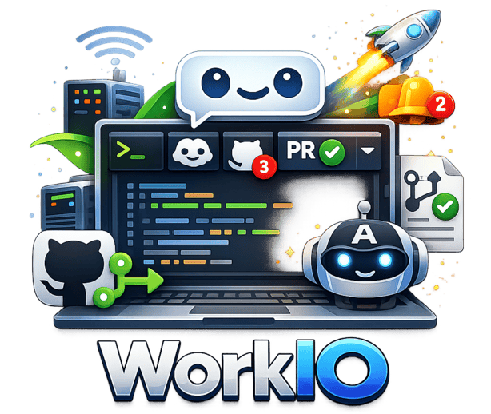

# WorkIO

<p align="center">
  
</p>

A developer dashboard that brings together your projects, temrinals, Claude AI sessions, and GitHub pull requests into a single interface. Manage multiple projects, monitor what Claude is doing, track PRs, and connect to remote machines -- all from one place.

## Features

- **Projects**
  - start a terminal locally or over SSH
  - clone Git repositories
  - use condcutor.json or individual setup/teardown scripts
  - add more workspaces from a project using Git worktrees
  - view all processes started from your terminal
  - view all ports running in your terminal
  - open your project in Cursor
- **GitHub PRs**
  - webhook integration for updates
  - view PR status of the current branch in your project
  - view PR list of all the repos you have projects in
  - view reviews, comments, running/failed checks
  - re request reviews from change requests
  - re run failed checks
  - merge PRs
- **Git**
  - changes badge
  - pull/push branches
- **Claude**
  - view all running Claude sessions on your system
  - view sessions started in your projects
  - pin claude sessions and take them anywhere with an always on top PiP
- **Command Palette**
  - access all your data in one place
- **Notifications**
  - Claude needs permissions or is done
  - PR activity
  - Project setup status
- **Zellij Tweaks**
  - copy to clipboard of multipage selection in panes
  - detect running processes in tabs
  - uses project name for session name
- **Keyboard Shortcuts**
- **PWA Ready**

---

## Prerequisites

Before running WorkIO, make sure the following are installed on your machine:

- **Node.js** (version specified in `app/.nvmrc`)
- **PostgreSQL** (server running, with `psql` client available)
- **Python 3.10+**
- **Claude CLI** -- install from [Anthropic's docs](https://docs.anthropic.com/en/docs/claude-code)
- **GitHub CLI (`gh`)** -- install from [cli.github.com](https://cli.github.com/) (optional, but needed for PR features)
- **Git** and **SSH** (for repository and remote machine features)

You also need to set up environment variables. Create a `.env.local` file in the project root:

| Variable | Required | Description |
|----------|----------|-------------|
| `DATABASE_URL` | Yes | PostgreSQL connection string (e.g., `postgresql://localhost/workio`) |
| `NGROK_AUTHTOKEN` | No | Enables GitHub webhook support for real-time PR updates. Get a token from [ngrok.com](https://dashboard.ngrok.com/get-started/your-authtoken). Without this, PR data only refreshes on manual actions. |
| `NGROK_DOMAIN` | No | Use a static ngrok domain instead of a random URL. Requires `NGROK_AUTHTOKEN`. Get a free static domain from your [ngrok dashboard](https://dashboard.ngrok.com/domains). |

---

## Run

The quickest way to get started:

```bash
./run.sh
```

This script handles everything: checks dependencies, adds Claude hooks, sets up the database, builds the app, and starts the server. The dashboard will be available at `http://localhost:5175`.

**Flags:**

- `./run.sh --rebuild` -- Force a fresh `npm install` and rebuild
- `./run.sh --drop-db` -- Drop and recreate the database from scratch

## Running for Development

```bash
cd app
npm install
npm run dev
```

This starts two processes in parallel:

- A backend server on port **5176** (with automatic reload on file changes)
- A frontend dev server on port **5175** (with hot module replacement)

Open `http://localhost:5175` in your browser.

**Other useful commands:**

```bash
npm run lint:fix    # Auto-fix lint and formatting issues
npm run check       # Run linting + TypeScript type checking
npm run build       # Production build
npm start           # Start the production server
```