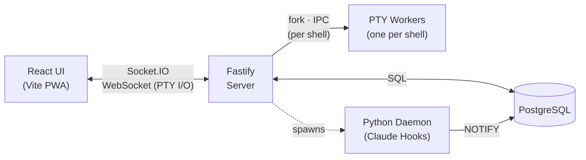

# WorkIO

<p align="center">
  
</p>

A developer dashboard that brings together your projects, terminals, Claude AI sessions, and GitHub pull requests into a single interface. Manage multiple projects, monitor what Claude is doing, track PRs, connect to remote machines, use it on your phone — all from one place.

## Features

### Projects
- Clone Git repositories
- Use `conductor.json` or individual setup/teardown scripts
- Add additional workspaces for a project using Git worktrees

### Terminals
- Start terminals locally or over SSH
- Multiple shell tabs per terminal with drag-and-drop reordering
- Shell integration for command tracking and Claude session linking
- View all processes and listening ports in your terminal
- Get notified for command completion
- Shell templates and custom commands
- Multi-client support with device indicators
- Open projects in Cursor/VSCode

### Claude Code
- View all running Claude sessions on your system
- View sessions started in your projects
- Tool visualization — see Bash, Edit, Read, Write tool calls with diffs
- Permission prompt detection and notifications
- Search across all session messages
- Star/favorite sessions
- Resume sessions in specific shells
- Move sessions between projects
- Pin sessions in an always-on-top Picture-in-Picture window
- `claude-skill` - add to your global Claude skills for additional functionality

### GitHub PRs
- PR updates via `gh` CLI polling or real-time repo webhooks (ngrok)
- View PR status of the current branch in your project
- View PR list of all repos you have projects in
- View reviews, comments, running/failed checks
- Create PRs with diff viewer and conflict detection
- Merge, close, edit title/description
- Re-request reviews, rerun failed checks
- Emoji reactions on comments and reviews
- Involved PRs — PRs where you're mentioned or review-requested
- Filter and silence authors

### Git
- Changes at a glance with dirty status tracking
- Pull, push, checkout, merge, rebase branches
- Commit dialog with file picker, diff viewer, staged/unstaged management
- Remote sync — shows ahead/behind commit counts
- Branch diff viewer with compare and commit history modes
- Create and manage worktrees

### Command Palette
Access everything with `Cmd+K` — multiple modes:
- Search: jump to sessions, terminals, branches
- Session search: search message content across sessions
- Actions: git operations, PR actions
- Custom commands: user-defined terminal shortcuts
- PR checkout: switch to PR branches
- Branch sessions: see Claude sessions on specific branches

### Notifications
- Claude permission requests and session completions
- PR activity (reviews, comments, checks)
- Project setup status
- Web push notifications (self-hosted with VAPID keys)
- Click to navigate to the relevant terminal/shell

### Mobile
- Responsive design for phones and tablets
- Custom mobile terminal keyboard with action buttons
- Drag-and-drop button reordering
- Edge swipe gesture to open/close sidebar
- Installable as a PWA

### Process & Port Detection

**Local terminals:**
- Uses `ps` to walk the process tree from the shell PID downward
- Active command detected via OSC 133 shell integration sequences
- Listening ports detected via `lsof` — matches ports to terminals by checking if the listening PID is a descendant of the shell
- Resource usage (CPU/memory) aggregated from all descendant processes

**SSH terminals:**
- Fetches the full process list from each SSH host once per scan cycle via `ps` over SSH (batched per host — one SSH call regardless of how many shells are on that host)
- Walks the remote process tree from the reported remote shell PID
- Resource usage computed from the same fetched data
- Listening ports detected via `ss` on the remote host, matched to terminal process trees
- Detected remote ports can be forwarded locally via automatic SSH reverse port forwarding

**Zellij (local):**
- Finds the Zellij server PID by matching unix socket paths via `lsof`
- Gets direct children of the server (pane shells) and their children (running commands)
- Matches sessions to terminals via `zellij list-sessions`

**Zellij (SSH):**
- Uses the already-fetched remote process list — zero extra SSH calls
- Walks down from the remote shell PID to find the Zellij client process, then locates the Zellij server (daemonized, ppid=1) from the full process list
- Gets pane processes the same way as local (server → pane shells → commands)
- Session naming uses `wiosession` shell helper which reads from `~/.workio/terminals/` and `~/.workio/shells/` on the remote host (written automatically on session creation)
- Limited to one Zellij server per SSH host — multiple concurrent Zellij servers on the same host cannot be disambiguated

### Zellij Integration
- Copy to clipboard for multi-page selections in panes
- Detect running processes in tabs
- Map project to session with `--session-name "$(wiosession)"`

### Keyboard Shortcuts
- Fully customizable key bindings
- Configurable via the settings modal

---

## Tech Stack

| Layer | Technologies |
|-------|-------------|
| Frontend | React 19, TypeScript, Vite, TailwindCSS, shadcn/ui |
| Terminal | xterm.js, node-pty (forked worker per shell), WebGL renderer |
| Backend | Fastify, Socket.IO |
| Database | PostgreSQL (direct SQL, no ORM) |
| Hooks | Python daemon for Claude Code lifecycle events |
| Real-time | Socket.IO channels + WebSocket per shell for PTY I/O |

---

## Prerequisites

Before running WorkIO, make sure the following are installed on your machine:

- **Node.js** (version specified in `app/.nvmrc`)
- **PostgreSQL** (server running, with `psql` client available)
- **Python 3.10+**
- **Claude CLI** — install from [Anthropic's docs](https://docs.anthropic.com/en/docs/claude-code)
- **GitHub CLI (`gh`)** — install from [cli.github.com](https://cli.github.com/) (optional, for PR features)
- **Git** and **SSH** (for repository and remote machine features)

**SSH host setup:** For git features (commit author detection, dirty status) to work properly on remote machines, configure git identity on each SSH host:

```bash
git config --global user.name "Your Name"
git config --global user.email "you@example.com"
```

You also need to set up environment variables. Create a `.env.local` file in the project root:

| Variable | Required | Description |
|----------|----------|-------------|
| `DATABASE_URL` | Yes | PostgreSQL connection string (e.g., `postgresql://localhost/workio`) |
| `NGROK_AUTHTOKEN` | No | Enables GitHub webhook support for real-time PR updates. Get a token from [ngrok.com](https://dashboard.ngrok.com/get-started/your-authtoken). Without this, PR data only refreshes on interval poll and manual actions. |
| `NGROK_DOMAIN` | No | Use a static ngrok domain instead of a random URL. Requires `NGROK_AUTHTOKEN`. Get a free static domain from your [ngrok dashboard](https://dashboard.ngrok.com/domains). |
| `BASIC_AUTH` | No | Protect the app with HTTP basic auth when accessed via the ngrok domain (format: `user:pass`). Local/LAN connections are not affected. GitHub webhook route is excluded. Per-IP lockout after repeated failed attempts. |

---

## Quick Start

```bash
./run.sh
```

This script handles everything: checks dependencies, adds Claude hooks, sets up the database, builds the app, and starts the server. The dashboard will be available at `http://localhost:5175`.

**Flags:**

- `./run.sh --rebuild` — Force a fresh `npm install` and rebuild
- `./run.sh --drop-db` — Drop and recreate the database from scratch

---

## Development

```bash
cd app
npm install
npm run dev
```

This starts two processes in parallel:

- A backend server on port **5176** (with automatic reload on file changes)
- A frontend dev server on port **5175** (with hot module replacement)

Open `https://localhost:5175` in your browser.

**Other useful commands:**

```bash
npm run lint:fix    # Auto-fix lint and formatting issues
npm run check       # Run linting + TypeScript type checking
npm run build       # Production build
npm start           # Start the production server
```

---

## Architecture


```mermaid
graph LR
    UI["React UI<br/>(Vite PWA)"] <-->|"Socket.IO<br/>WebSocket (PTY I/O)"| Server["Fastify<br/>Server"]
    Server <-->|SQL| DB[(PostgreSQL)]
    Server -->|"fork · IPC<br/>(per shell)"| Workers["PTY Workers<br/>(one per shell)"]
    Daemon["Python Daemon<br/>(Claude Hooks)"] -->|NOTIFY| DB
    Server -.->|spawns| Daemon
```

- **React frontend** communicates with the Fastify backend over Socket.IO for real-time events (git status, processes, PR checks, Claude hooks) and a dedicated WebSocket per shell for terminal I/O.
- **Fastify backend** manages shell sessions, runs git/gh commands, and serves the API. Each shell PTY is forked into its own child process to prevent event loop starvation.
- **PTY workers** — one Node.js child process per shell, spawned via `fork()`. Each worker owns a `node-pty` instance (or SSH session), handles OSC parsing for command detection, maintains an output buffer, and communicates with the master over IPC.
- **Python monitor daemon** listens for Claude Code hook events via a Unix socket, processes tool calls, and writes to PostgreSQL. The server is notified of changes via `NOTIFY`/`LISTEN`.
- **ngrok tunnel** (optional) exposes a webhook endpoint for real-time GitHub PR updates.

---

## Platform Support

WorkIO has been tested on **macOS** for local terminals and **Ubuntu (Linux)** for SSH remote terminals. Other platforms may work but are untested.
