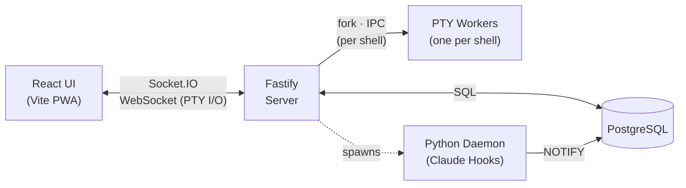

# WorkIO

<p align="center">
  
</p>

A web-based mini IDE that combines terminals, Git, Claude Code, and GitHub into a single interface. Manage projects, run shells locally or over SSH, commit and review code, monitor what Claude is doing, track PRs — all from one place, including your phone.

## Features

### Projects

- Clone Git repositories
- Use `conductor.json` or individual setup/teardown scripts
- Add additional workspaces for a project using Git worktrees

### Terminals

- Start terminals locally or over SSH
- Multiple shell tabs per terminal with drag-and-drop reordering
- Shell multiplexing with templates and custom commands
- Shell integration for command tracking and Claude session linking
- View all processes and listening ports in your terminal
- Get notified for command completion
- Process & Port Detection
- SSH terminal port mapping via reverse SSH tunnel
- Resource usage (CPU/memory)

### Claude Code

- View all running Claude sessions started in projects or on your system
- Claude sessions running on remote SSH machines are forwarded back to WorkIO via reverse tunnels
- Permission prompt detection and notifications
- Search across all session messages
- Resume sessions
- Move sessions between projects
- Pin sessions in an always-on-top Picture-in-Picture window
- `claude-skill` - add to your global Claude skills for additional functionality

### GitHub PRs

- PR updates via `gh` CLI polling or real-time repo webhooks
- PR management — View status, create, edit, merge/close
- Reviews & checks — View reviews/comments, re-request reviews, view and rerun running/failed checks, emoji reactions
- Discovery — Browse PRs across all your repos, track involved PRs (mentioned or review-requested)
- Filter and silence authors

### Git

- Changes at a glance with dirty status tracking
- Pull, push, checkout, merge, rebase branches
- Commit dialog with file list, diff viewer and editor, staged/unstaged management
- Remote sync — shows ahead/behind commit counts
- Branch diff viewer with compare and commit history modes

### Command Palette

Access everything with `Cmd+K` — multiple modes:

- Search: jump to sessions, terminals, branches
- Actions: git operations, PR actions
- Custom commands: user-defined terminal shortcuts
- PR checkout: switch to PR branches
- Branch sessions: see Claude sessions on specific branches

### Notifications

- Claude permission requests and session completions
- PR activity (reviews, comments, checks)
- Mobile push notifications

### Mobile

- Installable as a PWA, acts as a mirror for WorkIO running on your machine
- Custom mobile terminal keyboard with action buttons
- Edge swipe gestures

### Zellij Integration

- Map project to session with `--session-name "$(wiosession)"`
- Detect running processes in tabs
- Copy to clipboard for multi-page selections in panes

### Service Status

- At-a-glance health indicator for all backend services (database, ngrok, Claude tunnels, etc.)
- Per-service info modals with explanations

### Keyboard Shortcuts

---

## Tech Stack


| Layer     | Technologies                                                           |
| --------- | ---------------------------------------------------------------------- |
| Frontend  | React 19, TypeScript, Vite, TailwindCSS, shadcn/ui, tRPC + React Query |
| Terminal  | xterm.js, node-pty (forked worker per shell), WebGL renderer           |
| Backend   | Fastify, tRPC, Socket.IO                                               |
| Database  | PostgreSQL (direct SQL, no ORM)                                        |
| Hooks     | Python daemon for Claude Code lifecycle events                         |
| Real-time | Socket.IO channels + WebSocket per shell for PTY I/O                   |


---

## Prerequisites

Before running WorkIO, make sure the following are installed on your machine:

- **Node.js** (version specified in `app/.nvmrc`)
- **PostgreSQL** (server running, with `psql` client available)
- **Python 3.10+**
- **Claude CLI** — install from [Anthropic's docs](https://docs.anthropic.com/en/docs/claude-code)
- **GitHub CLI (`gh`)** — install from [cli.github.com](https://cli.github.com/) (optional, for PR features)
- **Git** and **SSH** (for repository and remote machine features)

**SSH host setup:** For git features (commit author detection, dirty status) to work properly on remote machines, configure git identity on each SSH host:

```bash
git config --global user.name "Your Name"
git config --global user.email "you@example.com"
```

You also need to set up environment variables. Create a `.env.local` file in the project root:


| Variable       | Required | Description                                                                                                                                                                                                                                           |
| -------------- | -------- | ----------------------------------------------------------------------------------------------------------------------------------------------------------------------------------------------------------------------------------------------------- |
| `DATABASE_URL` | Yes      | PostgreSQL connection string (e.g., `postgresql://localhost/workio`)                                                                                                                                                                                  |
| `BASIC_AUTH`   | No       | Protect the app with HTTP basic auth when accessed remotely via ngrok (format: `user:pass`). Required before enabling ngrok. Local/LAN connections are not affected. GitHub webhook route is excluded. Per-IP lockout after repeated failed attempts. |


---

## Quick Start

```bash
./workio.so
```

This script handles everything: checks dependencies, adds Claude hooks, sets up the database, builds the app, and starts the server. The dashboard will be available at `http://localhost:5175`.

**Flags:**

- `./workio.so --rebuild` — Force a fresh `npm install` and rebuild
- `./workio.so --drop-db` — Drop and recreate the database from scratch

---

## Development

```bash
cd app
npm install
npm run dev
```

This starts two processes in parallel:

- A backend server on port **5176** (with automatic reload on file changes)
- A frontend dev server on port **5175** (with hot module replacement)

Open `https://localhost:5175` in your browser.

**Other useful commands:**

```bash
npm run lint:fix    # Auto-fix lint and formatting issues
npm run check       # Run linting + TypeScript type checking
npm run build       # Production build
npm start           # Start the production server
```

---

## Architecture


```mermaid
graph LR
    UI["React UI<br/>(Vite PWA)"] <-->|"Socket.IO<br/>WebSocket (PTY I/O)"| Server["Fastify<br/>Server"]
    Server <-->|SQL| DB[(PostgreSQL)]
    Server -->|"fork · IPC<br/>(per shell)"| Workers["PTY Workers<br/>(one per shell)"]
    Daemon["Python Daemon<br/>(Claude Hooks)"] -->|NOTIFY| DB
    Server -.->|spawns| Daemon
```


- **React frontend** communicates with the Fastify backend over tRPC (queries and mutations) and Socket.IO for real-time events (git status, processes, PR checks, Claude hooks), plus a dedicated WebSocket per shell for terminal I/O.
- **Fastify backend** manages shell sessions, runs git/gh commands, and serves the API via tRPC domain routers. Each shell PTY is forked into its own child process to prevent event loop starvation.
- **PTY workers** — one Node.js child process per shell, spawned via `fork()`. Each worker owns a `node-pty` instance (or SSH session), handles OSC parsing for command detection, maintains an output buffer, and communicates with the master over IPC.
- **Python monitor daemon** listens for Claude Code hook events via a Unix socket, processes tool calls, and writes to PostgreSQL. The server is notified of changes via `NOTIFY`/`LISTEN`.
- **ngrok tunnel** - expose the app for remote access and enables real-time GitHub PR webhook updates.

---

## Platform Support

WorkIO has been developed and tested on **macOS** for local terminals and **Ubuntu (Linux)** for SSH remote terminals. Other platforms may work but are untested.

## Disclaimer

WorkIO was built as a personal tool, combining my daily workflows. It is not intended to be a full-fledged Claude, Git, or GitHub client supporting all their features.